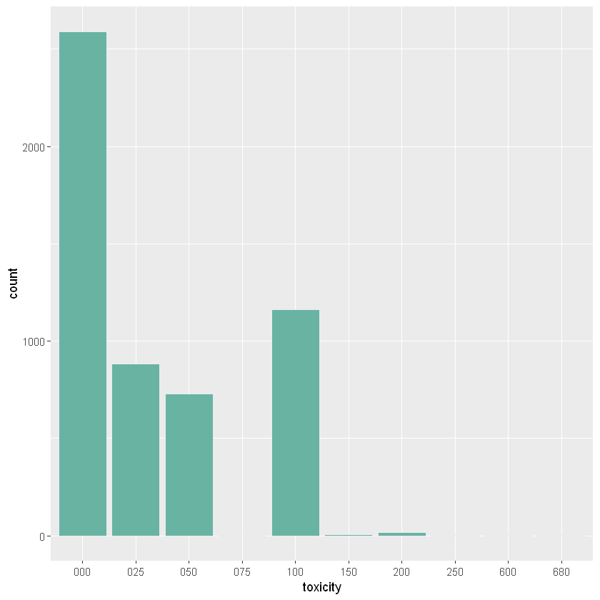

# Title clickbait detection

Detection and prediction of teasing/clickbait titles.

## Detail

This project was part of Youblock plugin, which is used to blur the toxic Youtube content that pollute our daily lives.

They passionately rated more than 5000 video by hand to allow me to work on this dataset ❤️.

Here is a little preview of the content

## Result

For the moment the does not generalize well enough to be exploitable.

## Installation

Download GoogleVector file in the "data" directory :

'real_data/GoogleNews-vectors-negative300.bin' Is available here [here](https://github.com/mmihaltz/word2vec-GoogleNews-vectors)

## License

This project is licensed under the MIT License - see the [LICENSE.md](LICENSE.md) file for details

## Acknowledgement
