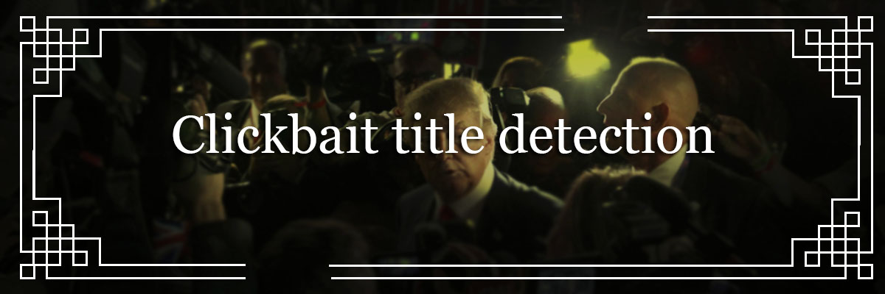

# Title clickbait detection

New version using word embeding and LSTM
average validation accuracy is around 75%

pretty promising model so far, taken into account the size of the dataset

Coming soon
- Transformer implementation
- Functional Flask API on a docker

## License
This project is licensed under the MIT License - see the [LICENSE.md](LICENSE.md) file for details
