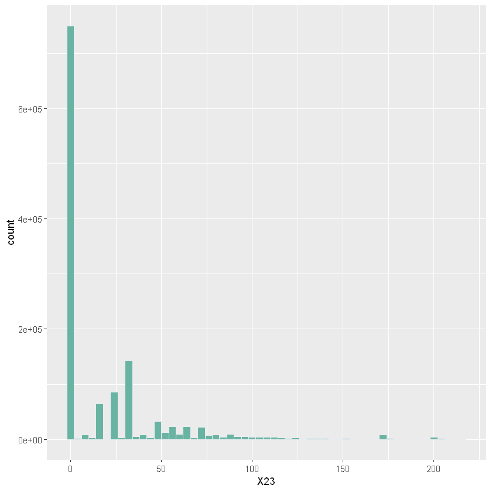

# Title clickbait detection

Detection and prediction of teasing/clickbait titles.
**USE THE BRANCH** [clickbait detector](https://github.com/BasileBron/Title-clickbait-detection/tree/clickbait_detector) **FOR THE MOMENT**

## Detail

This project was part of youblock plugin, wich is used to blur the toxic youtube content that pollute our daily lives.

More than one milion title of video evaluated on a scale 0 to 200 depending on how toxic the video is.
Here is a graph of the data:

## Instalation

You will need the google vocabulary file for the vectorization part :

'real_data/GoogleNews-vectors-negative300.bin' Is available here [here](https://github.com/mmihaltz/word2vec-GoogleNews-vectors)

## How it works

using a dataset of more than 1 millons title

## License

This project is licensed under the MIT License - see the [LICENSE.md](LICENSE.md) file for details

## Acknowledgement
